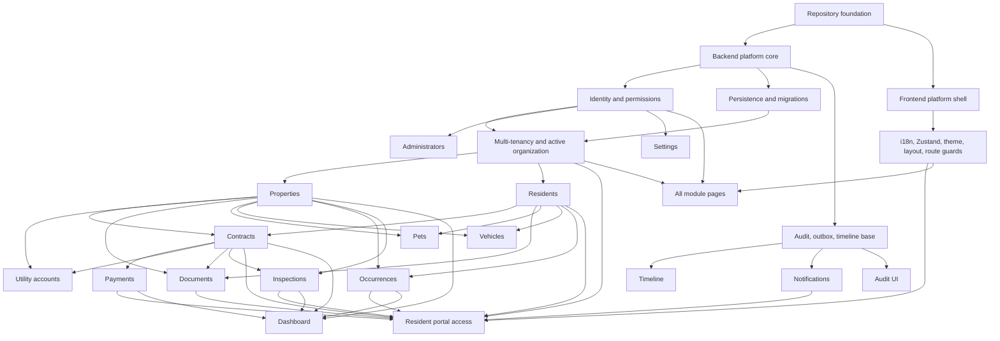

## Context

This is a new repository for Alsappan, a property management platform. The reference screen shows an authenticated admin area with a persistent left sidebar, a top bar, global actions, and a data-heavy module page for "Imoveis".

Visible menu items define the first product surface:

- Dashboard
- Imoveis
- Contratos
- Moradores
- Administradores
- Pagamentos
- Contas de Consumo
- Documentos
- Pets
- Veiculos
- Ocorrencias
- Vistorias
- Notificacoes
- Timeline
- Auditoria
- Configuracoes

The application must use Brazilian Portuguese (`pt-BR`) by default while supporting multiple languages. The backend must be .NET 10 and the frontend must be React with Zustand for client state management. The product must be multi-tenant from the first implementation, and residents/tenants must be able to log in through a resident portal. Because the repository is new, the plan can establish module boundaries, naming conventions, routes, API patterns, data model shape, localization, security, testing, and parallel implementation lanes before code is written.

## Goals / Non-Goals

**Goals:**

- Deliver an authenticated web application for operational property management.
- Support multiple organizations with strict tenant isolation from the first release.
- Support resident/tenant login through a resident portal with self-service visibility and selected request flows.
- Make every menu item implementable as an independent vertical capability with clear API, UI, data, permission, audit, notification, and timeline needs.
- Use React for the frontend and .NET 10 for the backend.
- Use Zustand for frontend client state such as shell state, active organization, auth/session view state, user preferences, filters, and optimistic local UI state.
- Default all user-facing copy, formats, dates, currency, validation messages, and domain labels to `pt-BR`.
- Support additional languages through locale resource files and backend localization without changing domain logic.
- Establish a reusable product shell matching the screenshot: sidebar, top bar, search, theme toggle, notification entry point, user/profile menu, and responsive behavior.
- Provide a dependency graph so frontend, backend, data, and QA work can be parallelized.
- Keep implementation realistic for a new repository: strong modular boundaries without prematurely splitting into microservices.

**Non-Goals:**

- Native mobile apps are out of scope for the first implementation.
- Public marketing pages are out of scope; the first screen is the authenticated product.
- Full accounting, bank integration, boleto/Pix issuance, WhatsApp delivery, OCR, electronic signature, and AI-based document extraction are not required for the first pass unless explicitly chosen later.
- Multi-company SaaS billing is not required in the first pass, but multi-tenant data isolation and organization membership are required.
- Replacing OpenSpec with another planning workflow is out of scope.

## Decisions

### 1. Product Architecture

Use a modular monolith backend and a React SPA frontend.

Recommended implementation:

- `src/Alsappan.Api`: .NET 10 HTTP API host.
- `src/Alsappan.Application`: use cases, commands, queries, validators, DTOs.
- `src/Alsappan.Domain`: entities, value objects, domain events, rules.
- `src/Alsappan.Infrastructure`: EF Core persistence, file storage, auth/token services, background jobs, integrations.
- `src/Alsappan.Web`: React frontend.
- `tests/`: backend unit/integration tests and frontend component/e2e tests.

Rationale:

- The domain is relational and operational, with many modules sharing the same users, properties, residents, contracts, documents, timeline, audit, and notifications.
- A modular monolith allows fast delivery while preserving module ownership.
- Future extraction to services remains possible if payments, documents, or notifications grow independently.

Alternatives considered:

- Microservices from day one: too much operational complexity for a new repository.
- Backend-for-frontend only with server-rendered React: less natural because the desired API surface is module-heavy and likely to serve future clients.

### 2. Frontend Stack

Use React with TypeScript, a Vite-style SPA setup, route-level code splitting, Zustand for client state, a data fetching cache for server state, and schema-backed forms.

Recommended libraries and conventions:

- React + TypeScript for the UI.
- React Router or file-based equivalent for authenticated routes.
- Zustand for client-side application state, including shell state, active organization, session UI state, persisted preferences, filters, and local workflow state.
- TanStack Query for API caching, invalidation, pagination, optimistic refresh, and request state.
- React Hook Form plus a schema validator for forms.
- CSS variables plus a component layer for theme, density, status badges, buttons, forms, dialogs, tables, and layout primitives.
- Locale resources under `src/i18n/locales/{locale}.json`.

Rationale:

- The screen is an authenticated operational tool, not a public landing site.
- A SPA keeps navigation fast across table/detail workflows.
- Zustand gives lightweight, explicit state stores without Redux ceremony and fits the operational shell/resident portal split.
- Query caching and route-level modules let teams implement menu items in parallel without creating divergent data access patterns.

Alternatives considered:

- Next.js: useful for public/server-rendered pages, but not necessary for a private CRUD-heavy app.
- Redux-first global state: unnecessary for server-state-heavy pages where query caching is a better default.
- Context-only state: acceptable for tiny apps, but too diffuse for a multi-module authenticated shell, organization switching, resident portal state, and persistent preferences.

### 3. Backend API Style

Expose versioned REST endpoints under `/v1`, with consistent list, detail, create, update, delete/archive, status transition, document attachment, timeline, and audit patterns.

Common API conventions:

- `GET /v1/{resources}` with `page`, `pageSize`, `sort`, and filter query parameters.
- `GET /v1/{resources}/{id}` for detail.
- `POST /v1/{resources}` for create.
- `PUT /v1/{resources}/{id}` for full update or `PATCH` for partial/status changes where useful.
- `DELETE /v1/{resources}/{id}` for soft delete/archive unless the domain requires permanent deletion.
- Problem Details for errors.
- OpenAPI generated from the backend and used to generate or validate frontend API types.
- All mutating requests MUST be audited.

Rationale:

- REST aligns with the table/detail CRUD workflows visible in the screen.
- Versioned routes let the API evolve after first release.
- OpenAPI becomes the contract between frontend and backend lanes.

Alternatives considered:

- GraphQL: attractive for complex dashboards, but adds query governance complexity before the domain is stable.
- RPC endpoints only: fast initially, but harder to standardize across many menu modules.

### 4. Database and Persistence

Use PostgreSQL with EF Core migrations and first-class organization scoping.

Recommended global columns:

- `id`
- `organization_id` for all tenant-scoped business records
- `created_at`
- `created_by`
- `updated_at`
- `updated_by`
- `deleted_at`
- `deleted_by`
- `row_version` or equivalent concurrency token.

Rationale:

- The domain is highly relational: properties, residents, contracts, payments, documents, utility accounts, pets, vehicles, occurrences, inspections, notifications, timeline, and audit all cross-reference one another.
- PostgreSQL is a strong default for JSON metadata where needed while keeping relational integrity.
- `organization_id` enforces multi-tenant isolation from the first release.

Alternatives considered:

- SQL Server: also viable for .NET; choose it if deployment hosting or team familiarity strongly favors Microsoft SQL Server.
- NoSQL-first: poor fit for contracts, payments, reporting, and audit consistency.

### 5. Identity, Roles, and Permissions

Implement first-party authentication with secure password storage, JWT access tokens, refresh sessions, organization memberships, role-based authorization, and explicit permission policies.

Recommended starter roles:

- `Administrador`: full system administration.
- `Gestor`: manages properties, contracts, residents, payments, documents, occurrences, and inspections.
- `Operador`: executes day-to-day CRUD with limited settings access.
- `Leitura`: read-only access to allowed modules.
- `Morador`: resident portal access to the resident's own permitted data and self-service actions.

Permission model:

- Roles map to granular permissions such as `properties.read`, `properties.write`, `payments.reconcile`, `audit.read`.
- A user can belong to multiple organizations; effective roles and permissions are evaluated for the active organization.
- Backend enforces permissions on every endpoint.
- Frontend hides unavailable actions but does not rely on hiding for security.
- Audit and settings are administrator-only by default.
- Resident accounts are linked to resident records and use resident-specific policies rather than administrative module permissions.

Alternatives considered:

- External identity provider from day one: defer unless enterprise SSO is required.
- Role-only model: simpler but becomes brittle once module-specific permissions appear.

### 6. Multi-Tenancy and Organization Isolation

Treat multi-tenancy as a first-class product requirement, not only a future-proofing field.

Recommended implementation:

- Model organizations, user organization memberships, membership roles, organization settings, and active organization selection.
- Require an active organization context for every authenticated admin request after login.
- Scope tenant business entities by `organization_id`.
- Add backend query filters and authorization checks so cross-organization access fails closed.
- Include organization context in audit, timeline, notification, background jobs, uploads, and dashboard projections.
- Allow users with multiple memberships to switch active organization from the authenticated shell.
- Keep platform-level operations out of the normal administrator UI unless explicitly introduced later.

Rationale:

- The user confirmed the product must be multi-tenant.
- Tenant isolation is much cheaper to enforce before the first schema and API are implemented.
- Settings, catalogs, notifications, roles, and data visibility differ by organization.

Alternatives considered:

- Single organization first with `organization_id` reserved: rejected because it would leave permission, settings, and testing assumptions under-specified.
- Separate database per organization: stronger isolation but more operational complexity; consider later if compliance or scale requires it.

### 7. Localization and Brazilian Defaults

Use `pt-BR` as the default locale and fallback. Support additional locales through deterministic resource keys and backend locale negotiation.

Frontend rules:

- All visible strings MUST come from locale resources.
- Routes may remain stable slugs in ASCII, but labels are localized.
- Dates, currency, percentages, numbers, and pluralization MUST use locale-aware formatting.
- The language switcher belongs in Settings and optionally in the profile menu.
- Initial supported locales: `pt-BR` and `en-US`.

Backend rules:

- Domain values are stored as canonical codes, not translated strings.
- Validation and Problem Details messages are localized based on user preference or `Accept-Language`.
- Domain catalogs that need display names store translations per locale.
- Audit logs store canonical event names plus structured payloads so they can be displayed in different languages later.

Alternatives considered:

- Hardcoded Portuguese for MVP: faster, but expensive to undo.
- Translating database values directly: creates reporting and consistency problems.

### 8. UI Information Architecture

The authenticated admin shell is the root product frame for administrators and staff. Residents use a separate resident portal shell with a smaller permission surface.

Admin route map:

- `/dashboard`
- `/imoveis`
- `/contratos`
- `/moradores`
- `/administradores`
- `/pagamentos`
- `/contas-de-consumo`
- `/documentos`
- `/pets`
- `/veiculos`
- `/ocorrencias`
- `/vistorias`
- `/notificacoes`
- `/timeline`
- `/auditoria`
- `/configuracoes`

Resident portal route map:

- `/portal`
- `/portal/perfil`
- `/portal/imovel`
- `/portal/contratos`
- `/portal/pagamentos`
- `/portal/documentos`
- `/portal/ocorrencias`
- `/portal/vistorias`
- `/portal/notificacoes`

Common page pattern:

- Page title and localized subtitle.
- Primary action button.
- Search/filter region.
- Data table or module-specific dashboard.
- Row actions with icon buttons.
- Create/edit form as a page, drawer, or dialog depending on complexity.
- Empty, loading, error, unauthorized, and archived states.
- Detail pages for entities with meaningful relationships.

The screenshot's "Imoveis" page implies the baseline list pattern:

- Search by name, address, neighborhood, city, or status.
- Table columns for property identity, location, status, suggested rent, garage, and actions.
- Status badges such as `Disponivel` and `Alugado`.
- Create action labeled `Novo imovel`.

The resident portal pattern:

- Uses the same design tokens, localization, auth, API client, Zustand stores, and formatting helpers.
- Does not show the administrative sidebar menu.
- Shows only the resident's linked property, contracts, payments, documents, occurrences, inspections, notifications, and profile actions.
- Allows resident-created occurrences and document uploads only when enabled by organization settings.

### 9. Domain Model Boundaries

Core modules and high-level ownership:

- Properties own address, rental status, garage information, suggested rent, availability state, and property attachments.
- Residents own person/contact/identification data, optional linked login accounts, portal preferences, and links to contracts, pets, vehicles, documents, and occurrences.
- Contracts connect properties and residents and define lease terms, lifecycle dates, rent obligations, and document references.
- Payments represent charges/receivables and their settlement state; they reference contracts, properties, residents, and documents where applicable.
- Utility accounts track non-rent recurring obligations by property/contract/responsible party.
- Documents are shared assets linked to one or more entities.
- Pets and vehicles are resident/property/contract registries with authorization state.
- Occurrences track operational issues, maintenance, complaints, and resolutions.
- Inspections manage scheduled condition checks with checklist results, photos, signatures, and reports.
- Notifications are user-facing messages generated by domain events or manual triggers.
- Timeline is a readable activity feed derived from domain events.
- Audit is immutable security/compliance history derived from commands and sensitive reads.
- Settings own configurable catalogs, locales, organization profile, tenant-specific defaults, resident portal options, notification preferences, and security settings.

### 10. Domain Events, Timeline, Notifications, and Audit

Use domain/application events as the shared backbone for cross-cutting records.

Examples:

- `PropertyCreated`
- `ContractActivated`
- `PaymentMarkedPaid`
- `OccurrenceResolved`
- `InspectionCompleted`
- `DocumentUploaded`
- `UserRoleChanged`
- `ResidentAccountActivated`
- `ResidentOccurrenceCreated`

Processing model:

- Mutating use cases write the primary transaction, audit record, and an outbox event.
- Background processing consumes outbox events and creates timeline and notification records.
- Audit records are written synchronously for security-sensitive actions.
- Timeline records can be regenerated or enriched from event payloads where appropriate.

Rationale:

- Avoids each module hand-writing notification/timeline logic inconsistently.
- Keeps audit reliable even if asynchronous notification delivery fails.

### 11. Document Storage

Use a storage abstraction with local development storage and a production provider.

Recommended first implementation:

- Local filesystem storage for development.
- S3-compatible object storage or Azure Blob Storage for production.
- Metadata in PostgreSQL, binary content outside the database.
- Antivirus/malware scanning hook as a future integration point.
- File access is authorized per linked entity and permission.

### 12. Search and Filtering

Implement module-level list search first, then global search.

Phase 1:

- Each module supports text search and structured filters.
- Search fields are explicit and indexed.

Phase 2:

- Top-bar search queries a global endpoint such as `/v1/search`.
- Search results group by entity type and deep link to details.

Rationale:

- The screenshot shows both top-bar search and module search. Module search is required for initial usability; global search can build on indexed module fields.

### 13. Testing Strategy

Backend:

- Domain unit tests for lifecycle rules.
- Application tests for use cases and permission checks.
- Integration tests for APIs, EF Core mappings, migrations, localization, and audit/timeline side effects.

Frontend:

- Component tests for shell, tables, forms, filters, badges, and dialogs.
- Route tests for permission-gated pages.
- E2E tests for primary flows: login, organization switching, create property, create resident, create contract, register payment, upload document, resolve occurrence, complete inspection, resident portal login, and resident occurrence creation.

Contract:

- OpenAPI validation in CI.
- Generated or checked API client types.

### 14. Implementation Phases

1. Foundation
   - Repository structure, solution, React app, formatting, linting, CI, Docker Compose for database, environment config.
2. Platform Shell
   - Auth shell, admin sidebar/topbar, resident portal shell, theme, locale, route guards, common table/form/status components, Zustand stores.
3. Backend Core
   - Identity, multi-tenancy, authorization, persistence, migrations, common API conventions, audit, outbox, timeline base.
4. Core Domain Vertical Slices
   - Properties, residents, contracts, documents.
5. Financial/Operational Modules
   - Payments, utility accounts, occurrences, inspections.
6. Associated Entity Modules
   - Pets, vehicles.
7. Administrative Modules
   - Administrators, settings, notifications, audit, dashboard, global search.
8. Hardening
   - Accessibility, localization completeness, tenant isolation checks, resident portal checks, performance, security review, backup/restore assumptions, e2e coverage.

### 15. Dependency Tree

Parallelization guidance:

- Foundation is the first shared blocker.
- Backend platform core and frontend platform shell can proceed in parallel once repository structure exists.
- After identity, persistence, active organization context, and common API conventions exist, properties and residents can start in parallel.
- Contracts depend on properties and residents.
- Payments depend on contracts.
- Utility accounts can start after properties, with contract linkage added later.
- Documents can start after storage and authorization, then add links to entities incrementally.
- Pets and vehicles depend on residents and properties but not contracts.
- Occurrences depend on properties/residents and can run parallel to payments.
- Inspections depend on properties and optionally contracts.
- Dashboard depends on enough module metrics to be meaningful.
- Timeline, notifications, and audit UI depend on event/audit foundation but can integrate module events incrementally.
- Resident portal depends on identity, multi-tenancy, residents, and enough linked modules to show useful self-service data; it can begin with profile/property/contract visibility and expand into payments, documents, occurrences, inspections, and notifications.

## Risks / Trade-offs

- [Risk] The app becomes a collection of inconsistent CRUD pages. -> Mitigation: build shared list, filter, form, detail, status, empty state, and permission patterns before vertical slices fan out.
- [Risk] Localization is postponed and hardcoded strings spread through the UI. -> Mitigation: require locale keys from the first shell component and block hardcoded production copy in review.
- [Risk] Domain terms vary between Portuguese and English in code. -> Mitigation: use English code identifiers and Portuguese UI strings; maintain a domain glossary.
- [Risk] Audit and timeline diverge. -> Mitigation: define event/audit interfaces early and require all mutating use cases to emit structured records.
- [Risk] Payments scope expands into full financial automation. -> Mitigation: first implement receivables/status/reconciliation records; defer bank integrations and boleto/Pix issuance unless prioritized.
- [Risk] Document uploads create security exposure. -> Mitigation: enforce file type/size restrictions, authorization checks, private storage, signed URLs, and a malware scanning extension point.
- [Risk] Multi-tenant isolation leaks data between organizations. -> Mitigation: enforce active organization context in backend policies, query filters, indexes, tests, audit records, background jobs, and storage paths.
- [Risk] Resident portal permissions become too broad because residents share identity infrastructure with administrators. -> Mitigation: use resident-specific policies, resident record links, separate portal routes, and dedicated resident portal tests.
- [Risk] Dashboard becomes blocked until every module is finished. -> Mitigation: ship dashboard widgets progressively with empty states and metrics contracts.
- [Risk] Status workflows differ by customer expectation. -> Mitigation: define starter lifecycle states and expose catalogs/settings for non-critical labels.

## Migration Plan

This is a new repository, so there is no data migration. Implementation migration is phased:

1. Initialize solution, frontend app, local database, CI, linting, formatting, and test runners.
2. Create core database schema and seed organizations, memberships, roles, permissions, statuses, locales, and domain catalogs.
3. Implement identity, multi-tenancy, authorization, audit, outbox, localization, and common API patterns.
4. Implement each vertical module behind protected routes.
5. Implement resident account linking and resident portal routes after residents/contracts exist.
6. Add dashboard aggregation and global search once enough indexed data exists.
7. Harden with accessibility, tenant isolation tests, resident portal tests, security, localization completeness, e2e coverage, and production configuration.

Rollback strategy:

- Before production data exists, rollback is repository-level.
- After production use starts, schema changes MUST be additive where possible.
- Destructive data changes require backup, migration verification, and a rollback script.

## Resolved Decisions and Remaining Questions

The user resolved the first product branch: the system is multi-tenant, residents/tenants must log in, and the remaining listed recommendations are accepted unless revisited later.

### Product and Business Scope

1. Should Alsappan manage one company or multiple client organizations?
   Decision: support multiple client organizations with first-class multi-tenant isolation.

2. Is the primary user a property manager, landlord, condominium administrator, or internal staff?
   Recommended: optimize for internal property management staff first.

3. Should owners/landlords have their own portal?
   Recommended: no for first pass; model ownership fields so a portal can be added later.

4. Should residents/tenants log in?
   Decision: yes; residents/tenants must be able to log in through a resident portal.

5. Should menu names remain exactly as shown in the screenshot?
   Recommended: yes for `pt-BR`, using accents in UI labels: `Imóveis`, `Veículos`, `Ocorrências`, `Notificações`, `Configurações`.

### Localization

6. Which languages are required at launch besides Brazilian Portuguese?
   Decision: ship `pt-BR` and `en-US`; prepare the resource structure for more languages.

7. Should URLs be localized?
   Decision: no; keep stable ASCII route slugs and localize labels/content.

8. Should backend validation messages be localized?
   Decision: yes, based on user preference with `Accept-Language` fallback.

9. Should currency support only BRL?
   Decision: default to BRL and store currency code per monetary field for future expansion.

### Security and Access

10. Should authentication be username/password, external provider, or both?
    Recommended: start with email/password plus refresh tokens; leave external provider integration for later.

11. Should MFA be required?
    Recommended: optional in settings for administrators; not required for MVP.

12. Should permissions be role-only or granular?
    Recommended: roles backed by granular permissions.

13. Should audit logs be exportable?
    Recommended: UI filters first; CSV export can be added after access policies are final.

### Property Model

14. What property types are needed?
    Recommended: apartment, house, commercial room, land, and other.

15. Should a property support multiple units?
    Recommended: model a property as the rentable unit first; add building/complex grouping later.

16. How should status work?
    Recommended: `Disponivel`, `Reservado`, `Alugado`, `Manutencao`, `Inativo`, `Arquivado`.

17. Should garage spaces be structured?
    Recommended: yes; store count and optional identifiers instead of free text only.

### Contracts and Residents

18. Can one contract have multiple residents?
    Recommended: yes, with one primary responsible resident.

19. Can one resident have multiple active contracts?
    Recommended: allow it at the data level but warn in the UI.

20. What contract statuses are required?
    Recommended: draft, active, ending soon, ended, terminated, cancelled, archived.

21. Should rent adjustments/indexers be modeled?
    Recommended: store adjustment date and indexer text/code; automate calculations later.

### Payments and Utilities

22. Are payments only records, or must the system issue invoices/boletos/Pix?
    Recommended: first release records charges, due dates, settlement, receipts, penalties, and discounts; integrations later.

23. Should partial payments be supported?
    Recommended: yes, through payment transactions linked to a charge.

24. Which utility account types are required?
    Recommended: electricity, water, gas, internet, condominium fee, IPTU, insurance, other.

25. Who is responsible for utility accounts?
    Recommended: property, resident/contract, or owner/organization.

### Documents

26. Which file types are allowed?
    Recommended: PDF, images, DOCX, XLSX, and plain text; restrict executable/archive uploads initially.

27. Should documents support versions?
    Recommended: yes, metadata-level versioning from day one.

28. Should documents be linked to multiple entities?
    Recommended: yes; use a generic document link table.

### Operations

29. Are occurrences maintenance tickets, complaints, incidents, or all of them?
    Recommended: all of them, differentiated by type and priority.

30. Should occurrences have comments?
    Recommended: yes, with attachments and status history.

31. Should inspections generate a PDF report?
    Recommended: yes eventually; first pass stores structured checklist data and attachments, then report generation.

32. Should inspections support signatures?
    Recommended: model signature slots, but allow completion without digital signature integration at first.

### Notifications, Timeline, and Dashboard

33. Which notification channels are required?
    Recommended: in-app first; email later; WhatsApp only after provider selection.

34. Should users configure notification preferences?
    Recommended: yes, for categories and channels.

35. What dashboard metrics matter most?
    Recommended: occupancy, overdue payments, upcoming contract expirations, open occurrences, pending inspections, recent activity.

36. Should timeline include every change or only meaningful events?
    Recommended: only meaningful business events; audit holds exhaustive technical changes.

### Technical and Delivery

37. Which database should be used?
    Recommended: PostgreSQL unless hosting constraints require SQL Server.

38. Should deployment target Docker, cloud app service, VPS, or something else?
    Recommended: container-ready from day one; final target can be chosen later.

39. Should tests be required before implementation merges?
    Recommended: yes; backend unit/integration tests and frontend component/e2e smoke tests.

40. Should the first implementation build every module fully or deliver vertical MVPs?
    Recommended: build foundation plus complete properties/residents/contracts/documents first, then expand remaining modules in parallel.
